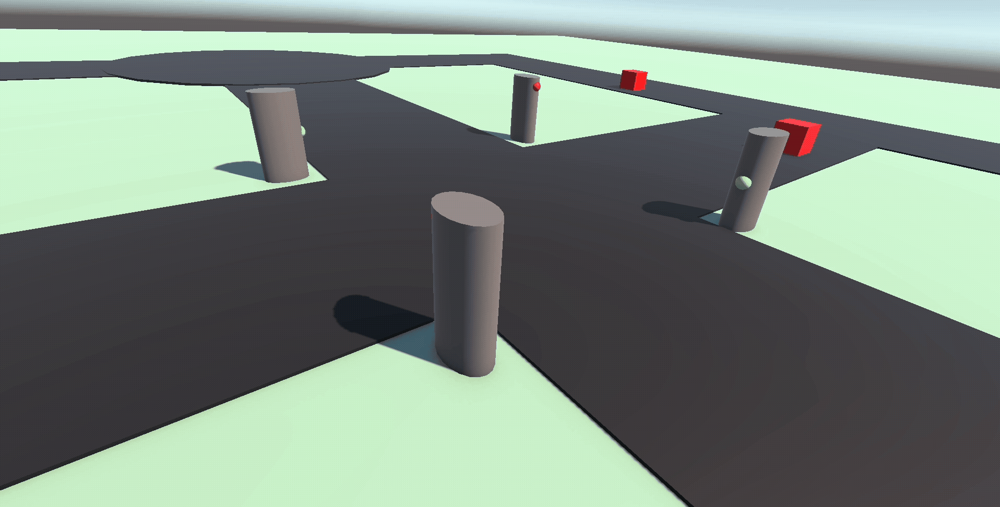

# Simulating Traffic in Unity
To create a basic traffic simulation that demonstrates vehicle movement, traffic light control and user interaction within a Unity environment.

### Scope:

* Develop a simple road network with intersections.
* Implement vehicles that navigate the network.
* Create traffic lights that control vehicle movement.
* Allow users to interact with traffic lights in real-time.

### Expected Outcomes:

* A functional Unity scene showcasing traffic flow.
* Interactive UI for controlling traffic signals.
* Documentation detailing the implementation process.

## Team Members

1. Chinmaya Mallappa Giriyappa 
2. Dileep Thiruvenkadam
3. Shweta Shankarappa

## Summary of Development/Research
This section details the key aspects of the development process, challenges encountered, solutions implemented and valuable lessons learned.

### 1. How Time Was Spent (Focus Areas):
* Core Traffic Logic : This involved designing and implementing the fundamental rules of traffic flow. This includes:

 * Pathfinding: How vehicles navigate the road network from a start to an end point.

 * Lane Management: Keeping vehicles in their lanes, handling lane changes.

 * Speed Control: Accelerating, decelerating, maintaining safe distances.

 * Collision Avoidance: Preventing vehicles from crashing into each other.

* Vehicle : Developing intelligent behavior for individual vehicles.

 * Intersection Handling: Vehicles understanding traffic lights, stop signs and right-of-way rules.

 * Behavior Trees/State Machines: Implementing decision-making processes for complex scenarios (e.g., "stop at light").

 * Dynamic Adaptation: Vehicles reacting to unexpected events or other vehicle behaviors.

* Road Network Generation & Management:

 * Creating a robust system to define roads, intersections, and traffic signals.

 * Ensuring smooth transitions between road segments.

 * Integrating traffic light logic with vehicle.

* Performance Optimization : With potentially hundreds or thousands of vehicles, performance is critical.

 * Profiling and identifying bottlenecks.

 * Implementing strategies to maintain a high frame rate.

### Challenges and Solutions:

* Challenge: Smooth Vehicle Movement & Physics Integration:

 * Problem: Integrating Unity's physics engine with custom movement could lead to jerky movements, unexpected collisions or vehicles "floating" above the road.

 * Solution: Carefully balanced between direct Transform manipulation for movement and Rigidbody physics for collision detection. Used raycasting/spherecasting to detect obstacles and the ground, ensuring vehicles stay on the road and react to slopes smoothly. Implemented PID controllers for steering and speed to provide natural-looking acceleration and turning.

* Challenge: Realistic Traffic Flow & Gridlock:

 * Problem: Early implementations often led to vehicles stopping unnecessarily, creating gridlock, lacking realism.

 * Solution: Implemented Car-Following Models to simulate human-like acceleration/deceleration based on the lead vehicle. Introduced randomized "human factors" like reaction times and slight speed variations to break uniformity.

### Lessons Learned:
* Iterative Development is Key: Starting with basic movement and gradually adding complexity (traffic lights, lane changes) allowed for easier debugging and refinement.

* Data-Driven Design: Separating road network data, vehicle properties, and traffic rules from code allowed for easier tweaking and balancing without code changes.

* Modularity: Breaking down the system into distinct components (e.g., VehicleController, TrafficLightController, RoadSegment) made the codebase manageable and easier to extend.

* Visualizing Debugging Information: Custom gizmos and debug lines in the Unity Editor for pathfinding, sensor ranges, and AI states were invaluable for understanding and fixing complex behaviors.

* Performance First Mindset: Planning for optimization from the beginning, especially with a simulation involving many agents, saves significant refactoring time later.

## Our Progress

